# DNA Methylation Classification for Brain Tumor Analysis

[](https://www.linkedin.com/in/pejman-ebrahimi-4a60151a7/)
[](https://huggingface.co/arad1367)
[](https://arad1367.github.io/pejman-ebrahimi/)
[](https://www.giltech-megoldasok.com/)

## Table of Contents
- [Project Overview](#project-overview)
- [Dataset Description](#dataset-description)
- [Installation](#installation)
- [Data Preparation](#data-preparation)
- [Analysis Pipeline](#analysis-pipeline)
- [Results](#results)
- [Technical Challenges](#technical-challenges)
- [Future Work](#future-work)
- [Contributing](#contributing)
- [License](#license)

## Project Overview
This project focuses on distinguishing methylation classes that match histological labels in brain tumor samples using DNA methylation data from the [GEO dataset-GSE218542](https://www.ncbi.nlm.nih.gov/geo/query/acc.cgi?acc=GSE218542). The analysis involves processing and classifying 86 samples across five main histological entities: GG-PTPN11, LGG-GG, LGG-MYB, LGG-DNT, and LGG-PXA.

### Reference Publication
The analysis is based on the data used in [PMC10175344](https://pmc.ncbi.nlm.nih.gov/articles/PMC10175344/).

## Dataset Description
- **Source**: GEO Dataset GSE218542
- **Sample Size**: 86 labeled samples
- **Features**: 128,526 methylation sites (measurements)
- **Classes**:
  - GG-PTPN11: 65 samples
  - LGG-GG: 9 samples
  - LGG-DNT: 5 samples
  - LGG-PXA: 4 samples
  - LGG-MYB: 3 samples

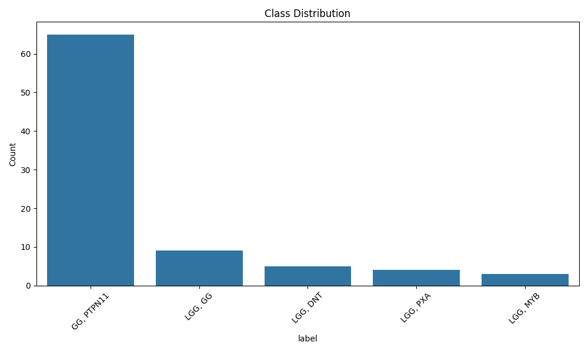
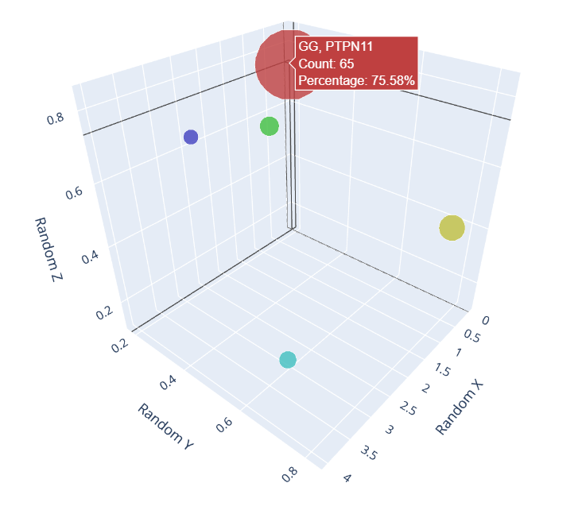

## Installation
```bash
git clone https://github.com/arad1367/DNA_Methylation_classes_Task.git
cd DNA_Methylation_classes_Task
pip install -r requirements.txt
```

## Data Preparation
The data preparation process involved several key steps:

1. **Initial Data Understanding**
   - Processing methylation matrix (GSE218542_Matrix_processed.txt)
   - Analyzing metadata (GSE218542_series_MetaData.txt)

2. **ID Mapping & Integration**
   - Created mappings between array IDs and GSM IDs
   - Integrated sample labels with methylation data
   - Final dataset shape: (86, 128526)

3. **Data Preprocessing**
   - Removed P-VALUE columns
   - Transposed data for ML compatibility
   - Added class labels
   - Handled missing values
   - Applied normalization (Scaling)
   - Implemented LabelEncoder
   - Split into train and test datasets

## Analysis Pipeline

### Dimension Reduction Analysis
We employed multiple dimension reduction techniques to visualize the data structure:

1. **PCA Analysis**
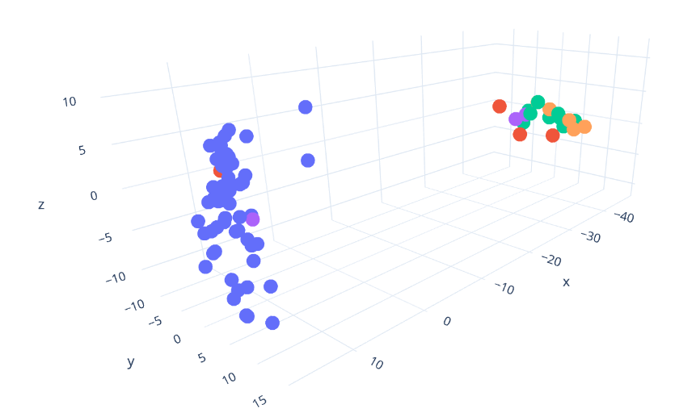

2. **t-SNE Analysis**
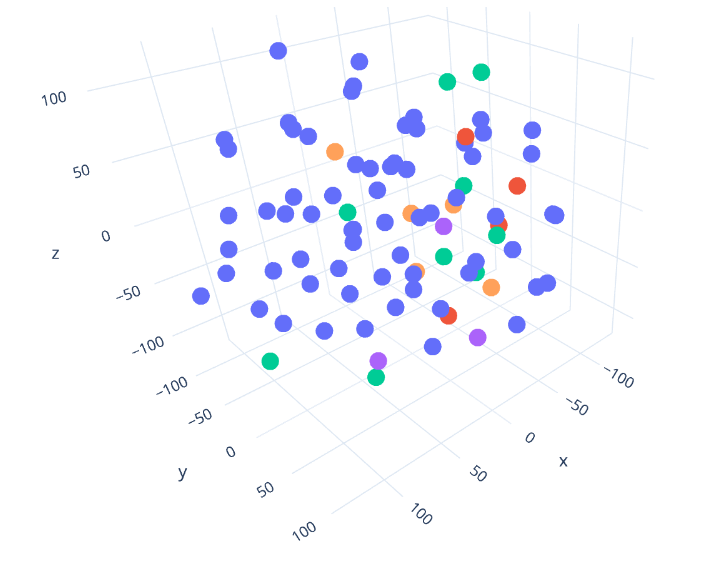

3. **UMAP Projection**
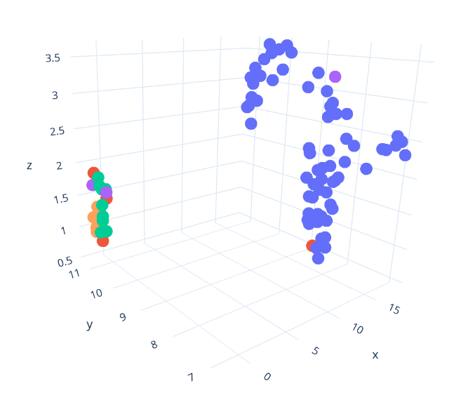

### Feature Selection
- Used f_classif for feature importance scoring
- Selected top 1000 most informative CpG sites
- Feature importance visualization:
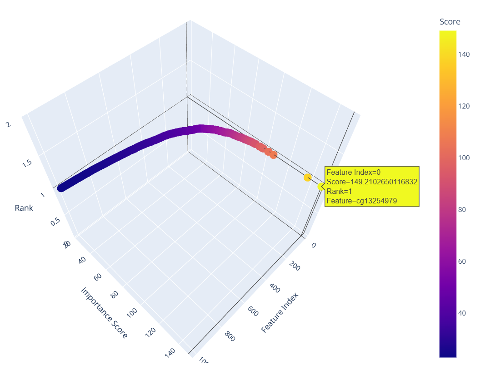

## Results

### Model Performance
We implemented and compared four classification models:

1. **XGBoost**
   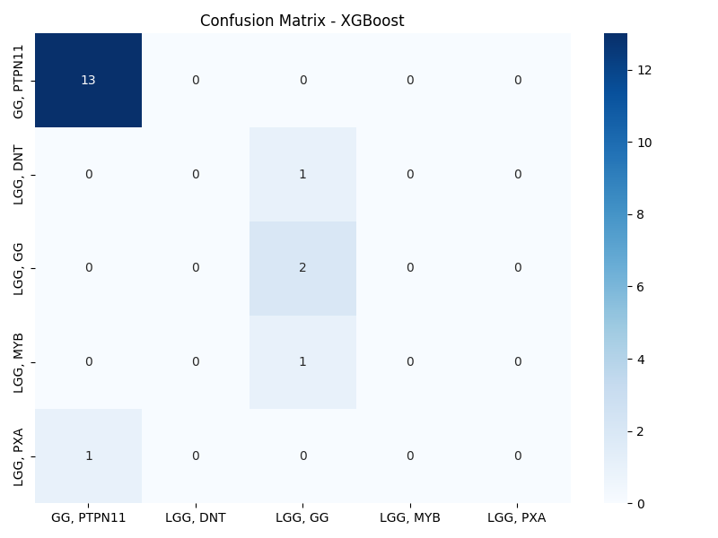
   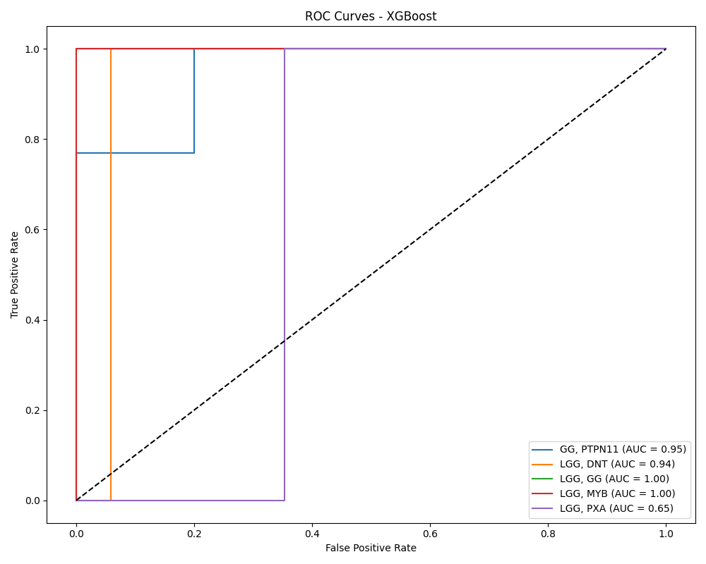

2. **Random Forest**
   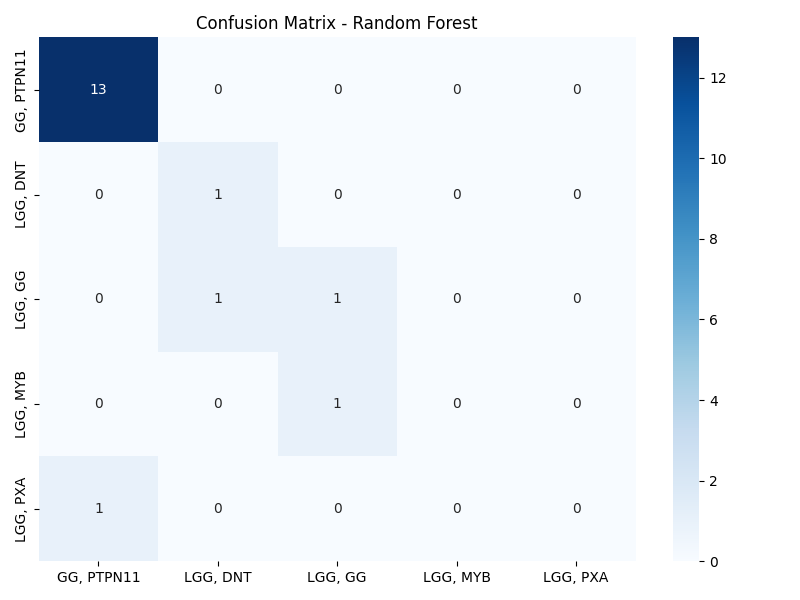
   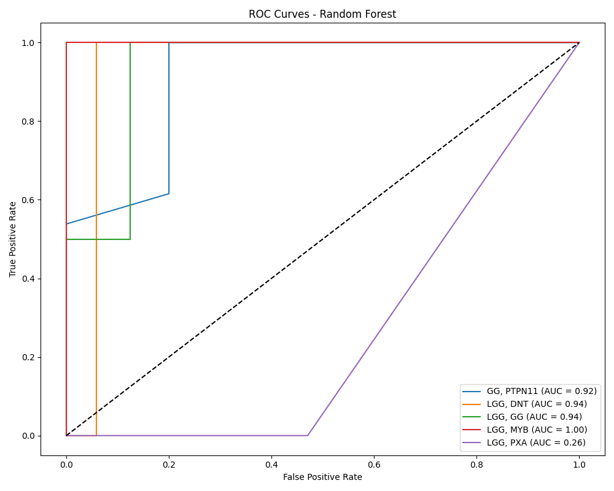

3. **SVM**
   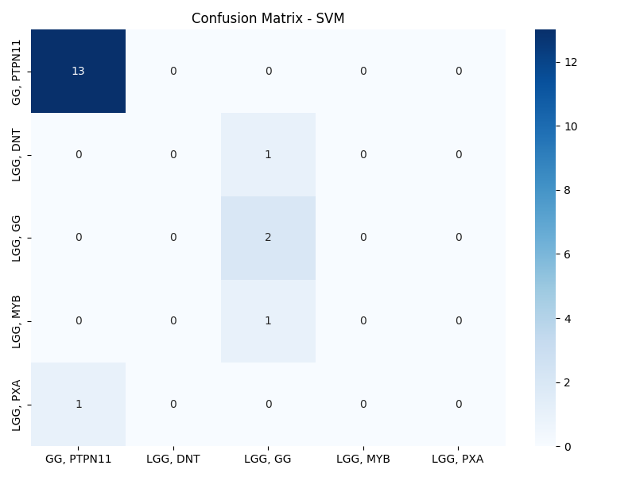
   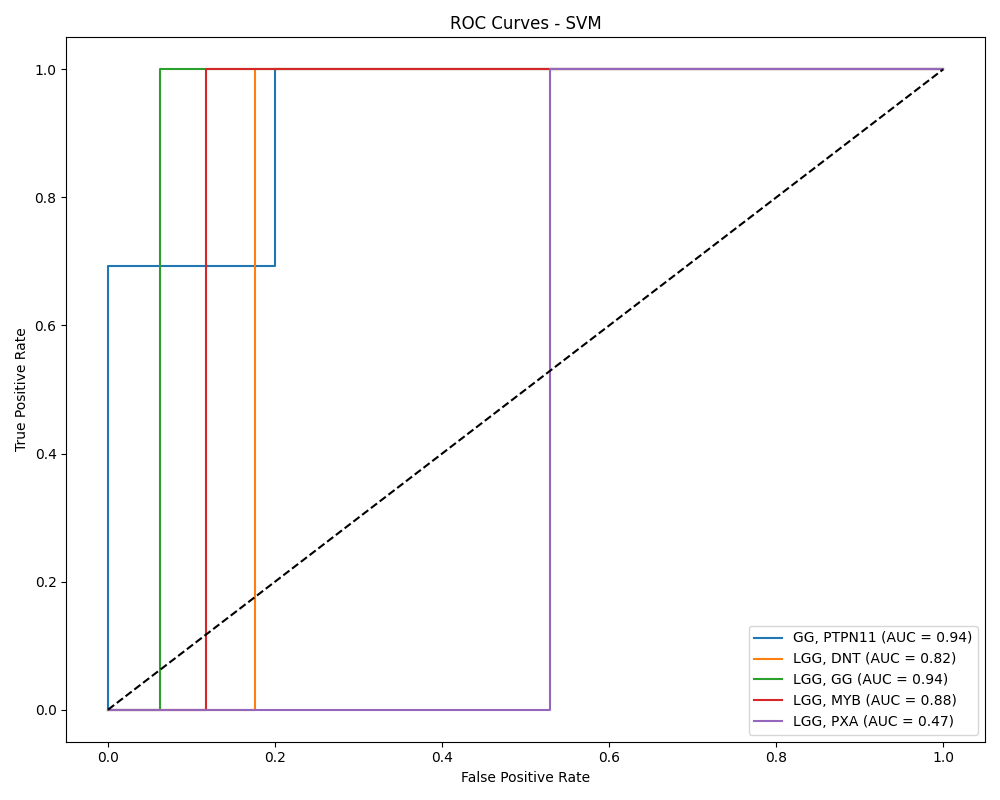

4. **Logistic Regression**
   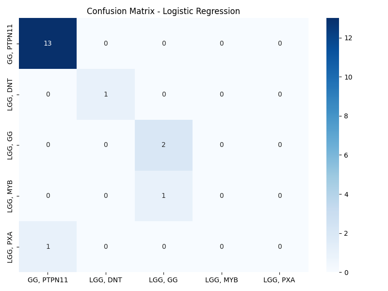
   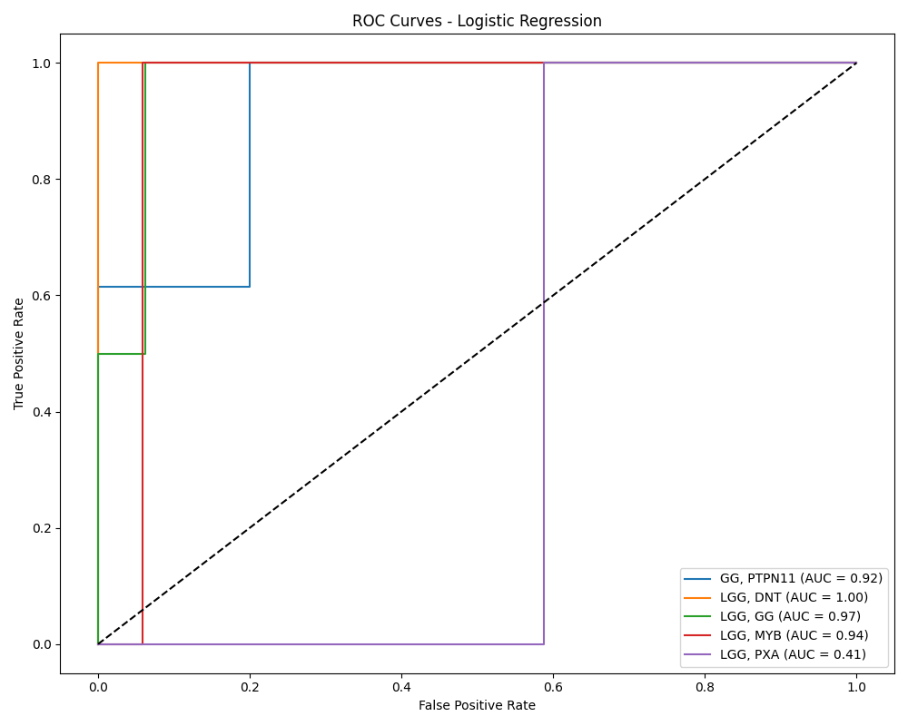

### Performance Metrics
- Logistic Regression achieved the highest accuracy at 88%
- Other models maintained consistent performance around 83%
- Detailed metrics available in the classification reports

## Technical Challenges
1. **Class Imbalance**
   - Highly skewed distribution (65 vs 3 samples)
   - Addressed using stratified sampling
   - Implemented balanced evaluation metrics

2. **High Dimensionality**
   - Original feature space: 128,526 dimensions
   - Reduced to 1000 most informative features
   - Validated through dimension reduction techniques

3. **Small Sample Size**
   - Limited samples in minority classes
   - Used cross-validation for robust evaluation
   - Careful feature selection to prevent overfitting

## Future Work
1. Expand the dataset with additional samples
2. Explore advanced sampling techniques for class balancing
3. Investigate deep learning approaches
4. Integrate additional molecular data types
5. Develop an automated pipeline for new sample classification

## Contributing
Contributions are welcome! Please feel free to submit a Pull Request.

## Contact
* pejman.ebrahimi77@gmail.com

## License
This project is licensed under the MIT License - see the LICENSE file for details.